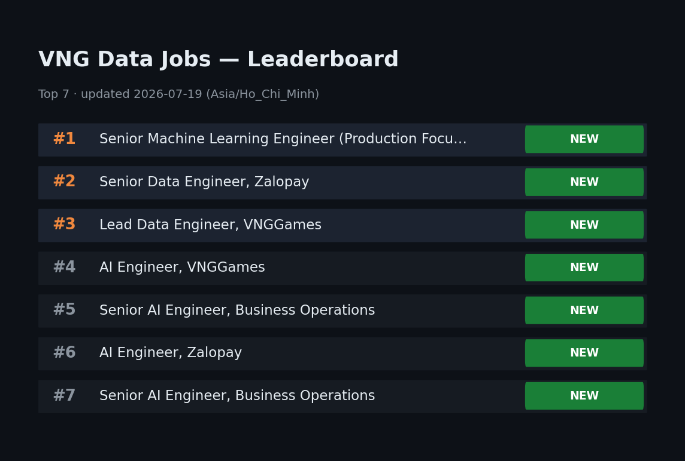

# VNG Data Jobs

Auto-updated daily. First-seen dates and open/closed status tracked in
[`data/jobs.csv`](data/jobs.csv).

## How it works

- Scrapes the filtered search at
  [career.vng.com.vn](https://career.vng.com.vn/tim-kiem-viec-lam?employee_type=Official&location_city=889&job_group=457%7C465%7C462%7C464)
  — Official positions in Hồ Chí Minh City, job groups: Data Engineering,
  Artificial Intelligence, Data Science, Business Analysis.
- Runs daily at **08:00 Asia/Ho_Chi_Minh** via GitHub Actions
  ([`scrape-vng-jobs.yml`](.github/workflows/scrape-vng-jobs.yml)).
- `date` = the day a job is first seen in this flow. `status` flips to `closed` once the job disappears from results.
- Sends a Telegram alert (new job links + leaderboard image) when new jobs
  appear — requires `TELEGRAM_BOT_TOKEN` and `TELEGRAM_CHAT_ID` repo secrets.